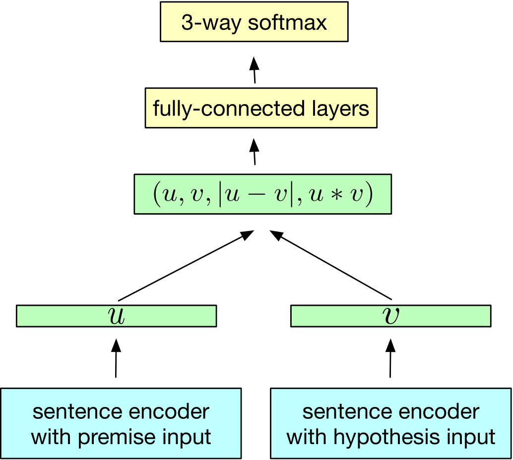

# Natural Language Inference (InferSent)
This is a re-implementation of the InferSent architecture proposed by Conneau et al. in "[Supervised Learning of
Universal Sentence Representations from Natural Language Inference Data](https://arxiv.org/abs/1705.02364)". The
implemented encoder models are (i) a baseline of averaging word embeddings, (ii) a unidirectional LSTM, (iii) a
BiLSTM (where the sentence representation comprises the concatenation of each direction's last hidden state), and
(iv) a BiLSTM with max-pooling over each dimension of the output vectors corresponding to each token. For more
information, please refer to the original paper.

Given a pair of sentences, namely the **premise** and the **hypothesis**, a deep neural model is tasked to predict
whether their relation is (i) entailment, (ii) contradiction, or (iii) neutral. In a training scheme such as the one
showcased below, each sentence gets encoded to a multidimensional representation, the combination of which gets fed
to a simple MLP classifier to predict the final output. By following this approach, we obtain an encoder that is able
to capture the semantic information present in each sentence, which can then be used for a plethora of other Natural
Language Understanding tasks.

<p align="center">
  
</p>

The trained encoder model can be evaluated with a set of NLU tasks such as the one proposed in "[SentEval: An
Evaluation Toolkit for Universal Sentence Representations](https://arxiv.org/abs/1803.05449)". By doing so, we test
whether the generated representations capture sufficiently broad linguistic and semantic information that is not
specific to the training task.

## Project Structure
The project is structured in the following way:
```
├── callbacks
│   └── lr_stopping.py  An LR monitor callback that halts training when the learning rate falls below a threshold.
├── demo.ipynb          A notebook that demonstrates the evaluation results and examples for model inference.
├── encoders
│   ├── baseline.py     The baseline encoder which averages the words' embeddings.
│   └── lstm.py         The LSTM-based encoders (both uni/bi-directional and with pooling).
├── eval.py             The evaluation pipeline, both for the SNLI task and a wrapper for the SentEval toolkit.
├── glove.py            A wrapper for the GloVe embeddings, which is responsible for reading from the txt file and converting to torch vectors.
│                       It also contains the functions to perform alignment with a target dataset's vocabulary.
├── models
│   └── classifier.py   The InferSet classifier as a PyTorch Lightning Module.
├── scripts
│   ├── glove.sh        A bash script that downloads the GloVe embeddings from the official repository.
│   └── senteval.sh     A bash script that downloads the SentEval toolkit, builds the python package and downloads the datasets.
├── snli.py             A PyTorch Lightning Data Module that wraps the huggingface dataset for the SNLI task.
└── train.py            The training pipeline for the SNLI task.
```

## Setup
In order to facilitate for a common development setup, please use the provided conda environment:
```shell
conda env create -f environment.yml
```

Additionally, the [GloVe](https://nlp.stanford.edu/pubs/glove.pdf) Common Crawl 840B embeddings need to be downloaded.
This can easily be done by using the [provided bash script](scripts/glove.sh), which will place them in the `./data`
directory. **wget** is required for this script.
```shell
sh scripts/glove.sh
```

Finally, to evaluate the encoders using SentEval, the toolkit needs to be present.
When using the aforementioned conda environment, you can simply execute the [provided bash script](scripts/senteval.sh)
which will clone the repository, install the python package *within the conda env*, and download the associated
datasets. **git** and **curl** are required for this script.
```shell
sh scripts/senteval.sh
```

## Training
In order to train a model on the [SNLI corpus](https://nlp.stanford.edu/projects/snli/), simply run the following command:
```shell
python train.py --encoder_arch <baseline ; lstm ; bilstm ; bilstm-max> --enable_progress_bar
```

The train script takes a plethora of (optional) launch arguments, which are summarized below:
```
--seed <int>                    The seed to use for the RNG. Default: 420
--max_epochs <int>              The max amount of epochs to train the classifier. Default: 20
--batch_size <int>              The batch size used by the dataloaders. Default: 64
--num_workers <int>             The number of subprocesses used by the dataloaders. Default: 3

--encoder_arch <str>            The name of the encoder architecture to use. Default: baseline
                                Must be one of {baseline,lstm,bilstm,bilstm-max}.
--lstm_state_dim <int>          The dimensionality of the hidden state in each LSTM cell. Default: 2048
--classifier_hidden_dim <int>   The dimensionality of the hidden layer in the MLP classifier. Default: 512
--lr <float>                    The initial learning rate for the classifier. Default: 0.1

--checkpoint <str>              The checkpoint from which to load a model.
                                WARNING: Due to a bug in PyTorch Lightning 1.6, this doesn't initialize the Trainer object correctly!
                                         This means that if you interrupt training, the optimizer & LR scheduler won't be resumed.
                                         More info: https://github.com/PyTorchLightning/pytorch-lightning/issues/12724

--enable_progress_bar           Whether to enable the progress bar (NOT recommended when logging to file).
--no_gpu                        Whether to NOT use a GPU accelerator for training.

--data_dir <str>                The data directory to use for embeddings & datasets. Default: ./data
--log_dir <str>                 The logging directory for PyTorch Lightning. Default: ./lightning_logs
```

## Evaluation
In order to evaluate a trained model either on the SNLI corpus or on SentEval, run the following command:
```shell
python eval.py --checkpoint <path_to_checkpoint>
```

Similarly, the eval script accepts the following (optional) launch arguments:
```
--checkpoint <str>      The checkpoint from which to load a model.
                        NOTE: This is NOT an optional argument.

--seed <int>            The seed to use for the RNG. Default: 420
--batch_size <int>      The batch size used by the dataloaders. Default: 64
--num_workers <int>     The number of subprocesses used by the dataloaders. Default: 3

--senteval              Whether to evaluate the model using the SentEval toolkit.
                        If this argument is not provided, the model will be evaluated on the SNLI test set.
--task <str>            The specific SentEval task to evaluate for.
                        If not defined, the model will be evaluated on the tasks of the Conneau et al. paper.
                        See here for the accepted values: https://github.com/facebookresearch/SentEval#3-evaluation-on-transfer-tasks

--enable_progress_bar   Whether to enable the progress bar (NOT recommended when logging to file).
--no_gpu                Whether to NOT use a GPU accelerator for training.

--data_dir <str>        The data directory to use for embeddings & datasets. Default: ./data
--log_dir <str>         The logging directory for Pytorch Lightning. Default: ./lightning_logs
--task_dir <str>        The directory with the downloaded datasets for SentEval. Default: ./SentEval/data
```

## Pre-trained models
You can find a copy of the saved checkpoints, along with the corresponding TensorBoard event files (for training and 
evaluation) and the SentEval results [**here**](https://drive.google.com/drive/folders/1OgSIler-e7qzaA6RLDgoFzAEpwRKI_sU).
This is particularly useful if you want to experiment with the provided Jupyter notebook that showcases the results
and demonstrates the usage of the models for inference in [demo.ipynb](demo.ipynb).
